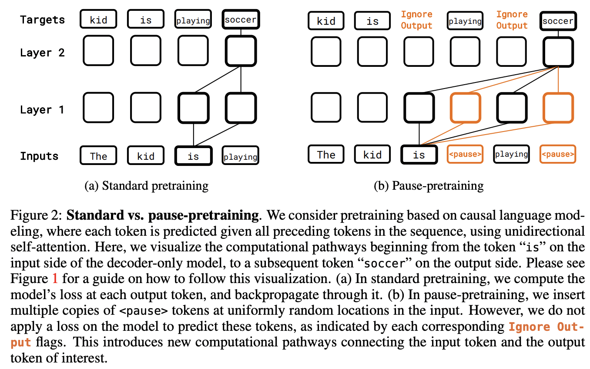

</img>

## Pause Transformer (wip)

Yet another random morning idea to be quickly tried and architecture shared if it works; to allow the transformer to pause for any amount of time on any token.

Again, the idea relies on axial attention; one axis attends along the sequence length as in the usual transformer, the other along a `thinking` or `pause` dimension.

## Todo

- [x] allow for custom pause distributions across token

- [ ] see if one can do a two pass, using the logit entropy as a way to decide how to shape the pause mask
- [ ] run experiments on enwik8, but if do not see anything, move onwards to something harder, say arithmetic

## Citations

```bibtex
@inproceedings{Goyal2023ThinkBY,
    title   = {Think before you speak: Training Language Models With Pause Tokens},
    author  = {Sachin Goyal and Ziwei Ji and Ankit Singh Rawat and Aditya Krishna Menon and Sanjiv Kumar and Vaishnavh Nagarajan},
    year    = {2023},
    url     = {https://api.semanticscholar.org/CorpusID:263608983}
}
```
